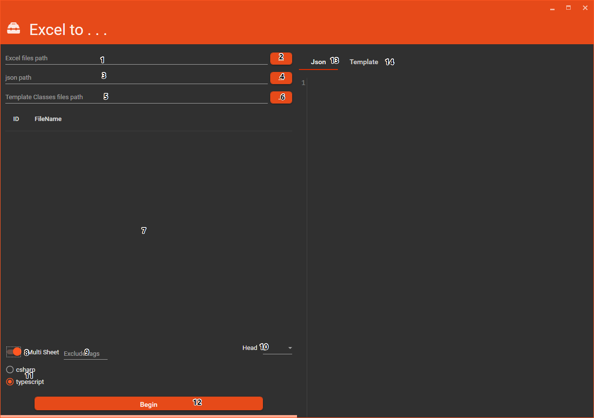
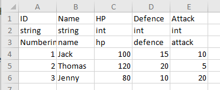

# Thanks

[neil3d](https://github.com/neil3d/excel2json)

# Excel to json

Export all excel files in the directory where excel is stored to json and generate C # or TypeScript template files

# How to use

## Description

* 1: input the directory of the excel files in here
* 2: or you can click this button to find the directory path
* 3: input the directory of the json files in here
* 4: or click this button to add the directory path
* 5: input the Template files directory in here
* 6: click this button you can add the Template files directory
* 7: if you input(add) the directory of the excel files, here will show the list of the excel files
* 8: when you select this CheckBox `9` will be visable, The meaning of this CheckBox is to allow multiple sheets of a single excel to be exported as json
* 9: when `8` was selected this TextBox will show. When the first character of a sheet's name matches the entered character, then the sheet will be filtered and not exported.
* 10: When the first character of a sheet's name matches the entered character, then the sheet will be filtered and not exported.
* 11: select a Template for exported
* 12: this butto clicked it will be export json, `3` is empty or not directory the Template file can not been exported
* 13,14: Preview of the json or Template

## Excel sheet formatting conventions

* The first line is fixed as the column name (used to construct the json field name)
* Second line is field type
* Third line is comment

> the second and third line can removed, but the first line must be keep. When the second and third lines do not exist, the template file will not be exported

# The Release File

[Release File](https://depac.coding.net/p/Excel2Json/attachment/default/preview/5536227)